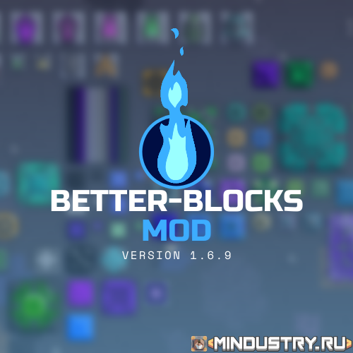
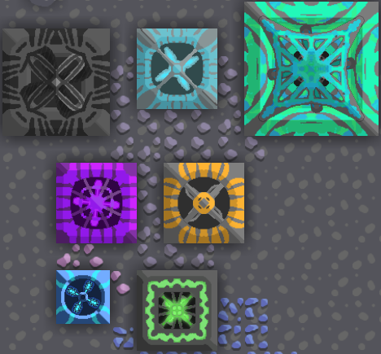
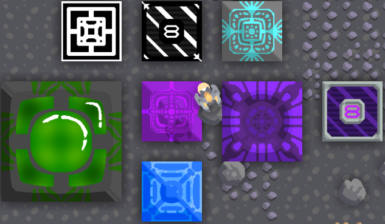
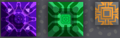
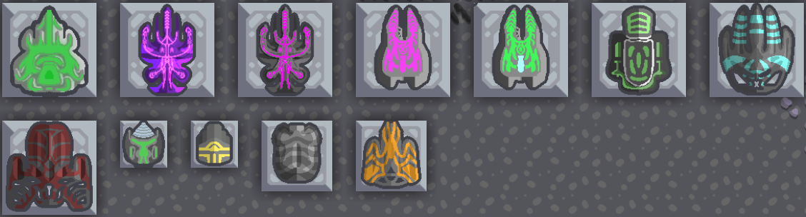

# Better-Blocks-Mod

 
  
ENG Description

Better-Blocks-Mod: this mod adds more blocks , materials and enemies.

The mod is being developed specifically for mindustry.ru.

For all questions, write to Discord: https://discord.mindustry.ru/

 
  
RUS Description

Better-Blocks-Mod: Этот мод добавляет больше блоков, материалов и врагов.

Мод разрабатывается специально для mindustry.ru.

По всем вопросам пишите в Discord: https://discord.mindustry.ru/

 
  
All blocks of this mod

   
   #Conveyors
   
 

   #Drill
   
 

   #Energy
   
 

   #Factories
   
 

   #Proector&Storage
   
 

   #Reconstructor
   
 

   #Turrets
   
 

   #Walls
   
  

# Translators
- [MemFaceGo](https://github.com/MemFaceGo) (Russian - Owner)
- [MINDUSTRYRU](https://github.com/MINDUSTRYRU) (First Developer)
